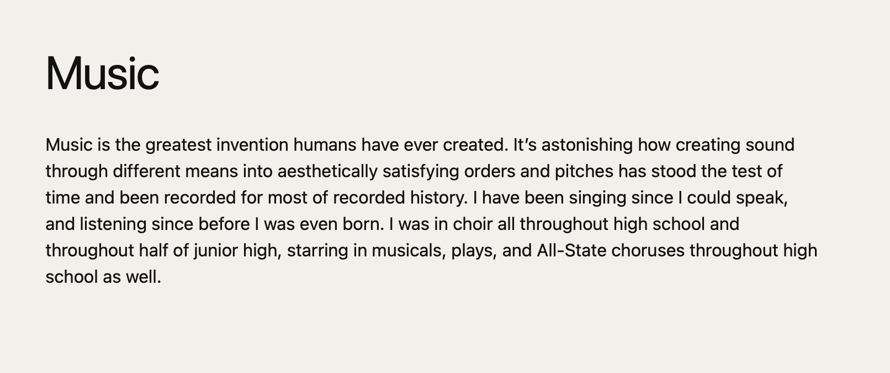
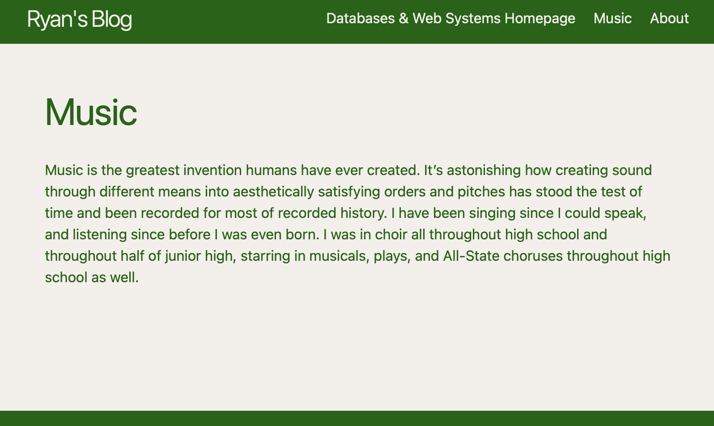

## **I did it!**
This lab was not the most complicated, as most things were set up for us, but other than the first website we made, it was the most like a lab from previous courses--that is, it gives us a template/already laid-out project and asks us to go in and change things. I created the [Music](https://ryfuller03.github.io/blog/music) as a sort of dummy file, edited the [About](https://ryfuller03.github.io/blog/about) section to actually include information about me, and added some fun colors! I'm a big fan of dark green and this kind of off-white color, and I feel like they went a long way here. I also changed the color of the text on posts to fit the green/off-white palette. Here's the music page and what it looks like *before* I changed its text body color:

And here it is *after* I changed the text color to match the rest of the website:

The change is very subtle, but it makes the posts of the website feel much more cohesive and integrated.

In terms of new things I learned, editing html files can be a bit messy. The formatting doesn't seem as readable or organized as Java's or Flutter's is (what I'm used to writing in). But I think with time I'll get used to it. Overall, though, there wasn't much that felt unfamiliar; because of previous courses I've taken here, the structure of getting a template/pre-made project and editing certain parts of it was smooth, and I am well-practiced regarding this kind of programming. I'm looking forward to updating this blog more as we get into more complex web systems, and learning more about Bootstrap to make my websites cleaner and more interesting. See y'all then!

