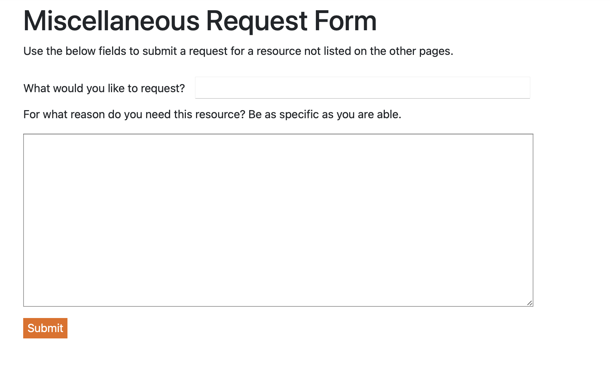
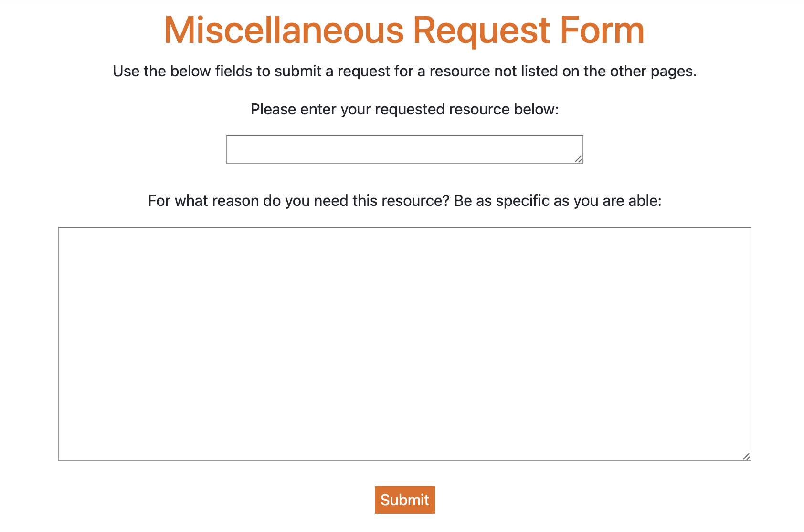

This week, Zoie and I were supposed to meet last Thursday and discuss with the head of the Student Outreach Services program how she would like their website to look, as well as what its overall functionality would be. However, due to scheduling conflicts, we were not able to meet with her, and that has been rescheduled to this Thursday.

So, I instead spent more time prettying up the Miscellaneous Request Form page, and I must say it's look really good now! I even learned some new CSS and JavaScript stuff to add transitions to the page's text. Here is what it looked like before:

And <i>this</i> is how it looks now!

I changed the color of the title text, moved everything over to the center to ground the page a little more, and changed the first text box so that it matches the style of the second better. Unfortunately, because it's a picture, you can't see the animations, but once it's done you're gonna love it, trust me!

This was a super fun and immersive way for me to learn a little more about how to move things around using CSS and Javascript to make the webpage feel more alive and welcoming to new users, so I'm glad I got a week to just mess around with these kinds of things and make a page I'm proud of. I can't wait to meet and discuss what the other pages are going to look like, and I'll update you all on my progress next week!