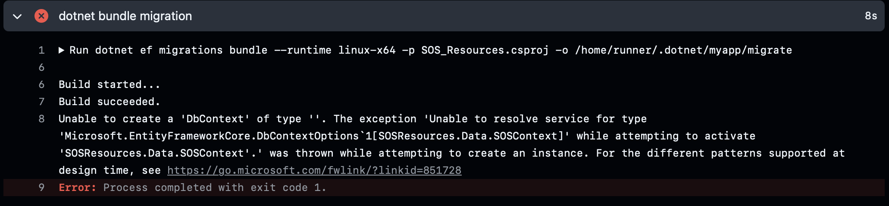

This week was a pretty heavy downer. Not much progress was made, but a lot of time was spent trying to get things to work. The biggest annoyance is that the building of the website works perfectly fine locally, but does not display any information, nor does it receive any either. Every source is pretty much blank and no assets are transferred over. On the Github side, the build is just not working at all, which is really unfortunate.

The worst part is that I believe these two issues are independent, but both need to be fixed before either one will work. Github says the issue is the database context, as there are two of them. However, after doing some file shuffling and renaming some database components, I was able to get this error instead:

I couldn't find much about other people encountering the same issue, but I will look more into it in our meeting tomorrow.

Locally it seems that the issue is with the port. The console said once that the port is already in use and so no information can be transferred over to it, but I cannot reproduce that error anymore. It may just have to do with the database stuff, but again, it works just fine locally.

There are other issues to tackle, but I ran out of time this week. Next week will be focused on just getting everything running before addressing anything else. It works on Zoie's machine, so it has to work on ours, right?